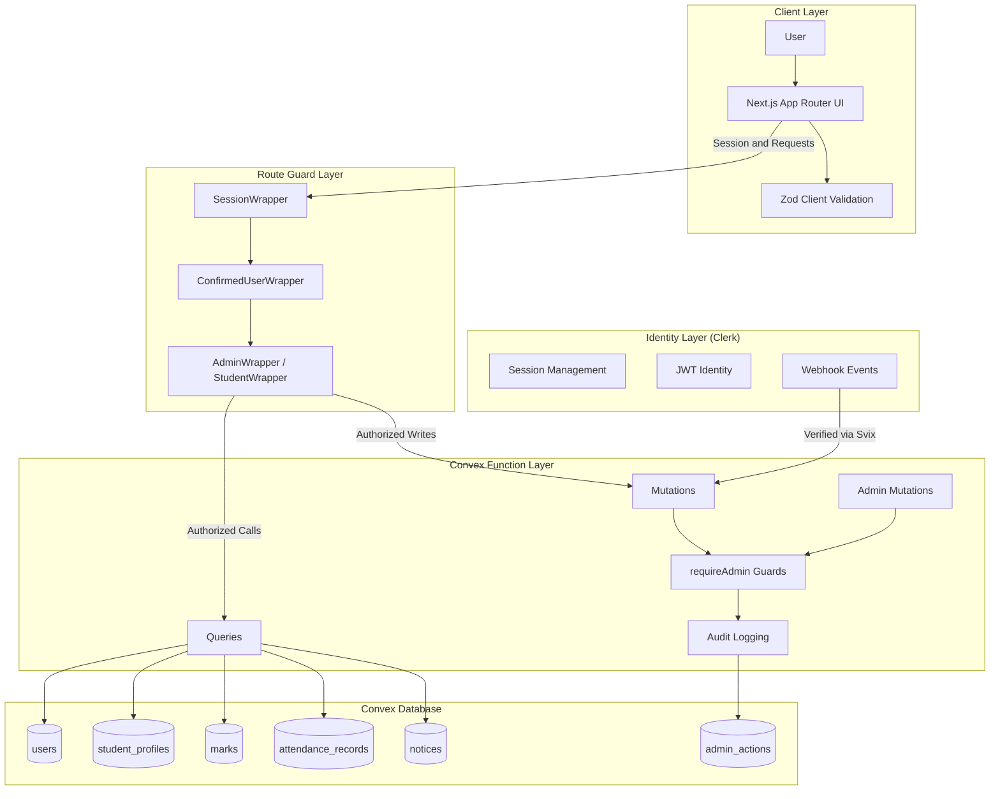
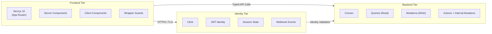
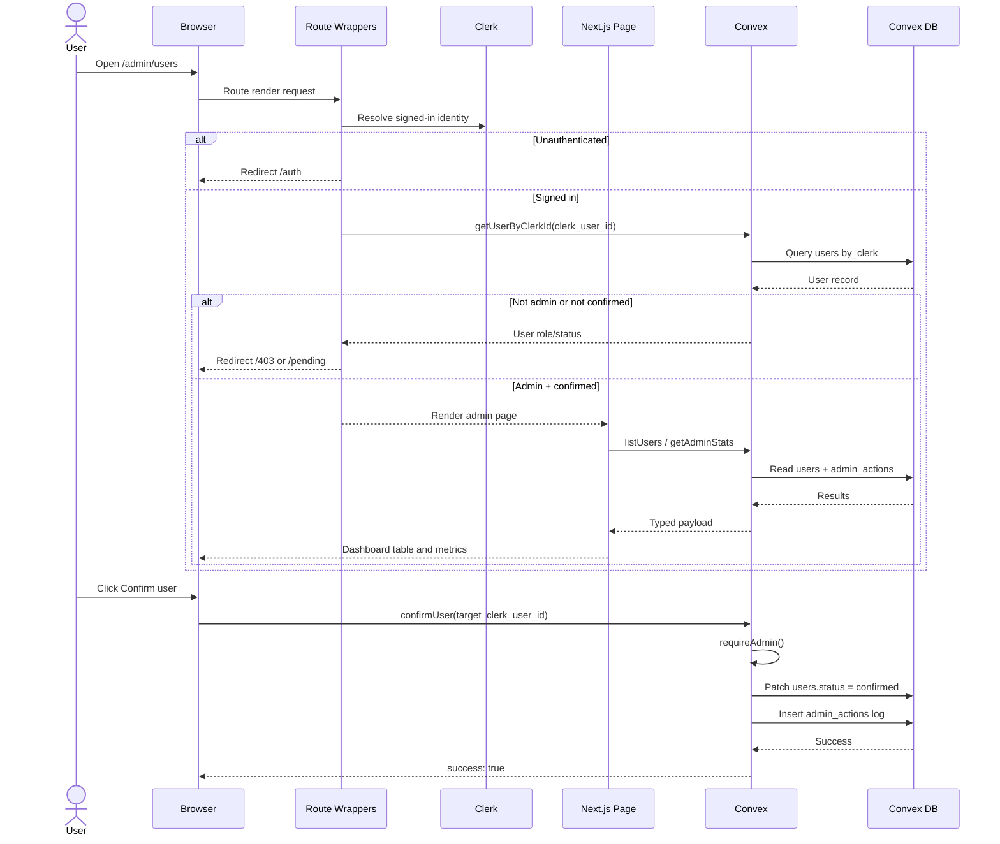
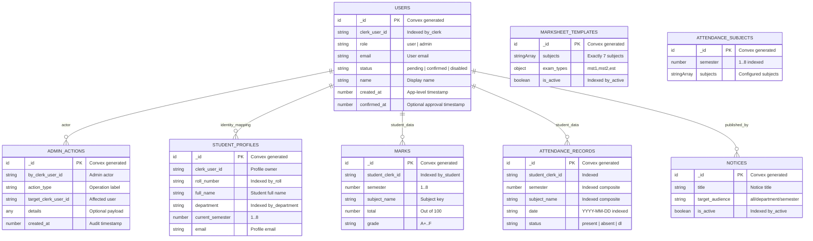

<div align="center">

# Security-First Student Management System

### A Security-First Full-Stack Academic Operations Platform


<br/>

<!-- TODO: Add live demo URL -->
<!-- TODO: Add issues URL -->
[Live Demo](#) | [Report](IT_Network_Security_Report.tex) | [Report Bug](#) | [Request Feature](#)

</div>

<details>
<summary>Table of Contents</summary>

- [Overview](#overview)
- [Features](#features)
- [Security Architecture](#security-architecture)
- [System Architecture](#system-architecture)
- [Data Flow](#data-flow)
- [Database Schema (ER Diagram)](#database-schema)
- [Tech Stack](#tech-stack)
- [Security Implementation](#security-implementation)
- [OWASP Top 10 Compliance](#owasp-compliance)
- [API Reference](#api-reference)
- [Environment Variables](#environment-variables)
- [Getting Started](#getting-started)
- [Project Structure](#project-structure)
- [Screenshots](#screenshots)
- [Roadmap](#roadmap)
- [Contributing](#contributing)
- [License](#license)
- [Author](#author)

</details>

## Overview

This project is a security-first full-stack student management platform built with Next.js, Clerk, and Convex for an IT Network Security course. It solves a real academic workflow problem by centralizing user onboarding, profile management, marks management, attendance tracking, and notice distribution in one role-aware system. Security is central to its design through layered controls such as authenticated sessions, backend-enforced RBAC, strict input validation, and audit logging of privileged operations. Unlike a basic CRUD dashboard, this system applies defense-in-depth at both UI and backend layers and uses immutable timestamped records for accountability. The result is a practical demonstration of secure-by-default engineering in a production-style serverless architecture.

> Academic Context: This project was built as part of the IT Network Security - II course to demonstrate practical implementation of cybersecurity principles in modern web development.

## Features

### Core Features

| Feature | Description | Status |
|---|---|---|
| Clerk Authentication | Sign-up/sign-in, session handling, webhook-driven user sync | Complete |
| Role-Based Access | Admin and user roles with route and backend authorization | Complete |
| User State Gating | Pending/confirmed/disabled state machine controls access | Complete |
| Student Profile Management | Student self-profile creation and controlled updates | Complete |
| Marks Management | Template-driven marks entry, grade calculation, per-semester views | Complete |
| Attendance Management | Subject templates, batch attendance marking, summary and reports | Complete |
| Notice Management | Admin publishing and soft deactivation of notices | Complete |
| Admin Dashboard | User stats, recent admin actions, operational shortcuts | Complete |
| Real-Time Data | Convex reactive subscriptions for live updates | Complete |
| Department Audience Targeting | Notice filtering by department/semester/all audience | Complete |

### Security Features

| Feature | Standard | Status |
|---|---|---|
| JWT + Session Validation | OWASP A07, NIST IA-2 | Complete |
| Backend RBAC Checks | OWASP A01, NIST AC-6 | Complete |
| Input Validation (Client + Server) | OWASP A03, NIST SI-10 | Complete |
| Webhook Signature Verification (Svix) | OWASP A08 | Complete |
| Audit Logging for Admin Actions | OWASP A09, NIST AU-3 | Complete |
| Defensive Name Sanitization | OWASP A03 | Complete |
| Environment Variable Separation | OWASP A05 | Complete |
| Anti-Spam Rate Limiting | OWASP A04 | In Progress |

## Security Architecture



## System Architecture



Frontend Tier Security Role  
The frontend uses wrapper-based gatekeeping before rendering sensitive routes. SessionWrapper enforces authentication, while role/state wrappers redirect unauthorized users to bounded routes (/auth, /pending, /403). Client forms apply Zod validation to reject malformed input early.

Identity Tier Security Role  
Clerk issues and manages user identity and sessions. User lifecycle events (user.created, user.updated, user.deleted) are sent through signed webhooks that are verified by Svix before any database mutation is allowed.

Backend Tier Security Role  
Convex functions enforce access control again server-side (never trusting client state). Admin operations require explicit requireAdmin checks and produce auditable records in admin_actions.

## Data Flow



## Database Schema

### ER Diagram



### Schema Reference

| Table | Field | Type | Constraints | Security Role |
|---|---|---|---|---|
| users | clerk_user_id | string | Indexed by_clerk | Identity binding to Clerk subject |
| users | role | enum | user/admin | RBAC enforcement root |
| users | status | enum | pending/confirmed/disabled | Access-state gating |
| users | confirmed_at | number? | Optional | Approval trace |
| admin_actions | by_clerk_user_id | string | Indexed by_admin | Attribution of privileged events |
| admin_actions | target_clerk_user_id | string | Indexed by_target | Scope of impact |
| admin_actions | details | any? | Optional | Context payload for forensics |
| student_profiles | roll_number | string | Indexed by_roll, uniqueness checked in mutation | Prevent identity collision |
| student_profiles | department | string | Indexed by_department | Targeted admin/report queries |
| marks | student_clerk_id | string | Indexed | Ownership and data scoping |
| marks | semester | number | 1..8 in handlers | Domain boundary validation |
| marks | grade | string | Derived | Integrity of computed result |
| notices | is_active | boolean | Indexed by_active | Soft moderation/deactivation |
| attendance_subjects | semester | number | Indexed by_semester | Config scoping |
| attendance_records | date | string | Indexed by_date, regex validated | Auditable time key |
| attendance_records | status | enum | present/absent/dl | Attendance integrity |
| * | _id | Id | Auto-generated | Immutable record ID |
| * | _creationTime | number | Auto-generated by Convex | Immutable creation metadata |

### Index Documentation

| Index Name | Table | Fields | Purpose |
|---|---|---|---|
| by_clerk | users | clerk_user_id | Fast identity lookup from Clerk subject |
| by_status | users | status | Status-filtered admin listing |
| by_role | users | role | Role-scoped reporting |
| by_admin | admin_actions | by_clerk_user_id | Actor-based audit queries |
| by_target | admin_actions | target_clerk_user_id | Target-based audit queries |
| by_created_at | admin_actions | created_at | Recent admin action stream |
| by_active | marksheet_templates | is_active | Active marks template fetch |
| by_student | marks | student_clerk_id | Student marks lookup |
| by_student_semester | marks | student_clerk_id, semester | Semester transcript retrieval |
| by_student_semester_subject | marks | student_clerk_id, semester, subject_name | Idempotent upsert for marks |
| by_clerk | student_profiles | clerk_user_id | Profile lookup by user identity |
| by_roll | student_profiles | roll_number | Roll uniqueness checks |
| by_department | student_profiles | department | Department filtering |
| by_active | notices | is_active | Active notice feed |
| by_published_at | notices | published_at | Time-ordered notices |
| by_semester | attendance_subjects | semester | Subject set by semester |
| by_student | attendance_records | student_clerk_id | Student attendance lookup |
| by_student_semester | attendance_records | student_clerk_id, semester | Per-semester attendance history |
| by_date | attendance_records | date | Date-based attendance fetch |
| by_date_semester_subject | attendance_records | date, semester, subject_name | Session-level batch attendance |
| by_student_semester_subject | attendance_records | student_clerk_id, semester, subject_name | Per-subject student summary |

## Tech Stack

| Category | Technology | Version | Why This? |
|---|---|---|---|
| Framework | Next.js | 16.1.6 | App Router + composable protected route architecture |
| Language | TypeScript | 5.x | Type safety across frontend and backend integration |
| UI Runtime | React | 19.2.3 | Modern component model and server/client split |
| Backend | Convex | 1.31.7 | Type-safe serverless functions with real-time updates |
| Authentication | Clerk | 6.37.3 (@clerk/nextjs) | Managed identity, JWT/session support, webhook lifecycle |
| Auth SDK (Server) | @clerk/backend | 2.30.1 | Secure server-side administrative user operations |
| Validation | Zod | 4.3.6 | Runtime schema validation for high-risk input paths |
| Styling | Tailwind CSS | 4.x | Utility-based styling with predictable rendering |
| Components | shadcn/ui | 3.8.4 | Accessible composable UI primitives |
| Animation | Framer Motion | 12.33.0 | Controlled UI transitions for UX clarity |
| Webhook Verification | Svix | 1.84.1 | Signed webhook integrity verification |
| Deployment | Vercel | TODO | Managed HTTPS and production hosting workflow |

## Security Implementation

<details>
<summary>Authentication and Session Management</summary>

**Standard:** NIST SP 800-53 IA-2, CIS Control 5

**What it does:** Ensures only authenticated users can access protected routes and Convex functions.

**How it is implemented:**

```typescript
const { isLoaded, isSignedIn } = useUser();

useEffect(() => {
  if (isLoaded && !isSignedIn && !isPublicRoute) {
    router.push("/auth");
  }
}, [isLoaded, isSignedIn, isPublicRoute, router]);
```

**Attack prevented:** Unauthorized route access and session spoof attempts.

</details>

<details>
<summary>Role-Based Access Control (RBAC)</summary>

**Standard:** NIST AC-6 (Least Privilege), OWASP A01

**What it does:** Prevents non-admin users from running privileged mutations and viewing protected data.

**How it is implemented:**

```typescript
async function requireAdmin(ctx: MutationCtx) {
  const identity = await ctx.auth.getUserIdentity();
  if (!identity) throw new Error("Unauthenticated");
  const caller = await ctx.db
    .query("users")
    .withIndex("by_clerk", (q) => q.eq("clerk_user_id", identity.subject))
    .first();
  if (!caller || caller.role !== "admin") throw new Error("Forbidden");
}
```

**Attack prevented:** Broken access control and privilege escalation.

</details>

<details>
<summary>Anti-Spam Rate Limiting</summary>

**Standard:** OWASP A04 (Insecure Design)

**What it does:** Current code validates request quality and prevents duplicate batch payload abuse. Full request throttling is planned.

**How it is implemented today:**

```typescript
const uniqueStudentIds = new Set(args.records.map((r) => r.student_clerk_id));
if (uniqueStudentIds.size !== args.records.length) {
  throw new Error("Duplicate student records found in attendance payload");
}
```

**Attack prevented:** Duplicate payload abuse in batch attendance submissions.

</details>

<details>
<summary>Input Validation and Schema Enforcement</summary>

**Standard:** OWASP A03, NIST SI-10

**What it does:** Validates high-risk fields at client and server to prevent malformed and unsafe data.

**How it is implemented:**

```typescript
export const marksEntrySchema = z.object({
  semester: z.number().min(1).max(8),
  marks: z.array(z.object({
    mst1: z.number().min(0).max(25),
    mst2: z.number().min(0).max(25),
    est: z.number().min(0).max(50),
  })),
});
```

**Attack prevented:** Input tampering and domain-constraint bypass.

</details>

<details>
<summary>User Verification State Machine</summary>

**Standard:** NIST AC-2, OWASP A01

**What it does:** Enforces account lifecycle transitions (pending -> confirmed / disabled) before full app access.

**How it is implemented:**

```typescript
if (dbUser === null) {
  router.push("/account-not-found");
} else if (dbUser && dbUser.status === "pending") {
  router.push("/pending");
} else if (dbUser && dbUser.status === "disabled") {
  router.push("/pending");
}
```

**Attack prevented:** Premature account usage before administrative approval.

</details>

<details>
<summary>Defensive Data Masking</summary>

**Standard:** Privacy by Design

**What it does:** Limits exposed sensitive identifiers in UI tables and logs.

**How it is implemented:**

```typescript
<span className="text-xs text-muted-foreground truncate self-center">
  {action.target_clerk_user_id.slice(0, 20)}...
</span>
```

**Attack prevented:** Full identifier exposure in low-trust viewing contexts.

</details>

<details>
<summary>Content Moderation and Governance</summary>

**Standard:** OWASP A04, governance control

**What it does:** Allows only admins to publish and deactivate notices, with action logging.

**How it is implemented:**

```typescript
export const deleteNotice = mutation({
  args: { notice_id: v.id("notices") },
  handler: async (ctx, args) => {
    const { callerClerkId } = await requireAdmin(ctx);
    await ctx.db.patch(args.notice_id, { is_active: false });
    await logAdminAction(ctx, callerClerkId, "delete_notice", callerClerkId);
  },
});
```

**Attack prevented:** Unauthorized notice tampering and untracked moderation.

</details>

<details>
<summary>Audit Trail and Immutability</summary>

**Standard:** NIST AU-3/AU-12, OWASP A09

**What it does:** Records privileged actions with actor, target, and timestamp for forensics.

**How it is implemented:**

```typescript
await ctx.db.insert("admin_actions", {
  by_clerk_user_id: callerClerkId,
  action_type: actionType,
  target_clerk_user_id: targetClerkUserId,
  details,
  created_at: Date.now(),
});
```

**Attack prevented:** Non-repudiation gaps and weak incident investigation.

</details>

## OWASP Compliance

| # | Vulnerability | Status | Implementation |
|---|---|---|---|
| A01 | Broken Access Control | Mitigated | Wrapper-level route guards plus server-side requireAdmin checks |
| A02 | Cryptographic Failures | Mitigated | Clerk session/JWT and HTTPS deployment |
| A03 | Injection | Mitigated | Zod validation, Convex validators, strict field constraints |
| A04 | Insecure Design | Mitigated | Defense-in-depth wrappers + backend authorization + user states |
| A05 | Security Misconfiguration | Mitigated | Environment variable separation and missing-secret checks |
| A06 | Vulnerable Components | Monitored | Dependencies pinned; regular patching still required |
| A07 | Identification and Authentication Failures | Mitigated | Clerk identity/session plus status gating |
| A08 | Software and Data Integrity Failures | Mitigated | Svix signature validation before webhook processing |
| A09 | Security Logging and Monitoring Failures | Partial | admin_actions table exists; centralized SIEM pending |
| A10 | SSRF | N/A/Low | No arbitrary server-side URL fetch path exposed to user input |

## API Reference

### Queries (Read Operations)

| Function | Args | Returns | Auth Required | Description |
|---|---|---|---|---|
| internalGetUserByClerkId | { clerk_user_id: string } | User or null | Internal only | Resolve user by Clerk ID |
| getUserByClerkId | { clerk_user_id: string } | User or null | Yes (self/admin) | Fetch user record by Clerk ID |
| listUsers | { page?, page_size?, status_filter? } | users+pagination | Admin | List users with optional status filter |
| getAdminStats | {} | stats object | Admin | Counts and recent admin actions |
| getConfirmedStudents | {} | User[] | Admin | Confirmed users with role user |
| getActiveTemplate | {} | MarksheetTemplate or null | Yes | Get active marks template |
| getMarksByStudentSemester | { student_clerk_id, semester } | Marks[] | Admin | Student marks for semester |
| getMyMarks | { semester } | Marks[] | Signed-in user | Own marks by semester |
| getAttendanceSubjects | { semester } | AttendanceSubjectTemplate or null | Yes | Subjects configured for semester |
| getAttendanceByDateSubject | { date, semester, subject_name, department_filter? } | attendance rows | Admin | Session attendance matrix |
| getStudentAttendanceSummary | { student_clerk_id, semester } | subject summaries | Admin | Student attendance summary |
| getMyAttendanceSummary | { semester } | subject summaries | Signed-in user | Own attendance summary |
| getAttendanceReport | { semester, department_filter?, subject_name?, start_date?, end_date? } | report rows | Admin | Filtered attendance report |
| getStudentProfile | { clerk_user_id } | StudentProfile or null | Self/Admin | Profile by user identity |
| getMyProfile | {} | StudentProfile or null | Signed-in user | Current user profile |
| listStudentProfiles | { department_filter?, semester_filter?, search? } | StudentProfile[] | Admin | Searchable profile list |
| checkRollNumberExists | { roll_number } | boolean | Public callable | Roll collision check |
| getActiveNotices | {} | Notice[] | No | Active notices |
| getAllNotices | {} | Notice[] | Admin | All notices |
| getMyNotices | {} | Notice[] | Signed-in user | Audience-filtered notice feed |

### Mutations and Actions (Write Operations)

| Function | Args | Returns | Auth Required | Description |
|---|---|---|---|---|
| createUser (internalMutation) | UserObject | { status, id } | Internal | Upsert user from webhook |
| deleteUserByClerkId (internalMutation) | { clerk_user_id } | { success: true } | Internal | Delete user row by Clerk ID |
| createStudentProfile | profile fields | { success, id } | Signed-in user | Create student profile |
| updateMyProfile | editable profile fields | { success: true } | Signed-in user | Update own profile |
| confirmUser | { target_clerk_user_id } | { success: true } | Admin | Confirm pending user |
| deleteUserFromDb (internalMutation) | { target_clerk_user_id, caller_clerk_id } | { success: true } | Internal | Database side delete helper |
| deleteUser (action) | { target_clerk_user_id } | { success: true } | Admin | Delete in Clerk then Convex |
| disableUser | { target_clerk_user_id } | { success: true } | Admin | Disable user account |
| saveTemplate | { subjects: string[] } | { success, id } | Admin | Create/update active marks template |
| saveMarks | { student_clerk_id, semester, marks[] } | { success: true } | Admin | Upsert marks and grade |
| saveAttendanceSubjects | { semester, subjects[] } | { success, id } | Admin | Configure attendance subjects |
| markAttendanceBatch | { date, semester, subject_name, records[] } | { success: true } | Admin | Batch attendance upsert |
| updateAttendanceRecord | { record_id, status } | { success: true } | Admin | Update one attendance record |
| createNotice | { title, description, priority, target_audience } | { success, id } | Admin | Publish notice |
| deleteNotice | { notice_id } | { success: true } | Admin | Deactivate notice |
| updateStudentProfile | { clerk_user_id, editableFields... } | { success: true } | Admin | Admin profile updates |

## Environment Variables

Create a `.env.local` file in the root directory:

```env
# Clerk Authentication (Next.js)
NEXT_PUBLIC_CLERK_PUBLISHABLE_KEY=pk_test_...
CLERK_SECRET_KEY=sk_test_...
CLERK_WEBHOOK_SECRET=whsec_...
CLERK_JWT_ISSUER_DOMAIN=your-clerk-domain.clerk.accounts.dev

# Convex
NEXT_PUBLIC_CONVEX_URL=https://your-deployment.convex.cloud
CONVEX_DEPLOYMENT=your-convex-deployment

# Optional Clerk URL Routing
# NEXT_PUBLIC_CLERK_SIGN_IN_URL=/sign-in
# NEXT_PUBLIC_CLERK_SIGN_UP_URL=/sign-up
# NEXT_PUBLIC_CLERK_AFTER_SIGN_IN_URL=/
# NEXT_PUBLIC_CLERK_AFTER_SIGN_UP_URL=/
```

> Security Note: Never commit `.env.local`. `CLERK_SECRET_KEY` and `CLERK_WEBHOOK_SECRET` are sensitive secrets. Variables prefixed with `NEXT_PUBLIC_` are exposed to the browser and must never contain private credentials.

## Getting Started

### Prerequisites

- Node.js >= 18.17.0
- npm >= 9.x
- Clerk account
- Convex account

### Installation

1. **Clone the repository**
   ```bash
   git clone https://github.com/USERNAME/REPO.git
   cd it-experiment-2
   ```

2. **Install dependencies**
   ```bash
   npm install
   ```

3. **Set up Convex project**
   ```bash
   npx convex dev
   ```

4. **Set up Clerk credentials**
   - Create an app in Clerk Dashboard.
   - Add keys to `.env.local`.

5. **Set up environment variables**
   ```bash
   # Windows PowerShell
   Copy-Item .env.example .env.local
   # If .env.example does not exist, create .env.local manually.
   ```

6. **Run the development server**
   ```bash
   npm run dev
   ```
   Open http://localhost:3000

7. **Promote first admin user**
   - Sign up in app.
   - Open Convex dashboard data for users.
   - Set your row values: role = "admin", status = "confirmed".

## Project Structure

```text
it-experiment-2/
|-- app/                              # Next.js App Router pages
|   |-- admin/                        # Admin dashboard modules
|   |   |-- users/                    # User approval/disable/delete
|   |   |-- marks/                    # Marks entry and review
|   |   |-- notices/                  # Notice creation and management
|   |   |-- students/                 # Student profile management
|   |   `-- attendance/               # Setup, mark, reports
|   |-- student/                      # Student-facing portal pages
|   |-- auth/                         # Auth entry page
|   |-- pending/                      # Pending/disabled access page
|   |-- 403/                          # Forbidden page
|   `-- account-not-found/            # User sync failure page
|
|-- components/
|   |-- wrappers/                     # Security wrappers
|   |   |-- SessionWrapper.tsx        # Session guard
|   |   |-- ConfirmedUserWrapper.tsx  # Status-state guard
|   |   |-- AdminWrapper.tsx          # Admin-only guard
|   |   `-- StudentWrapper.tsx        # Student-only guard
|   |-- admin/                        # Admin components
|   `-- ui/                           # shadcn/ui library
|
|-- convex/                           # Backend and data model
|   |-- schema.ts                     # Table/index definitions
|   |-- auth.config.ts                # Clerk JWT provider config
|   |-- http.ts                       # Signed webhook ingestion
|   |-- functions/
|   |   |-- queries.ts                # Read API surface
|   |   |-- mutations.ts              # User/internal writes
|   |   `-- adminMutations.ts         # Admin writes + logging
|   `-- types/
|       `-- index.ts                  # Convex validator schema objects
|
|-- lib/
|   |-- validations.ts                # Zod schemas
|   |-- convexAuth.ts                 # Clerk/Convex auth helpers
|   `-- ConvexClerkProvider.tsx       # Provider wiring
|
|-- AUTH_SETUP.md
|-- IT_Network_Security_Report.tex
`-- package.json
```

## Screenshots

<table>
  <tr>
    <td align="center"><strong>Student Dashboard</strong><br/></td>
    <td align="center"><strong>Authentication (Clerk)</strong><br/></td>
  </tr>
  <tr>
    <td align="center"><strong>Admin User Management</strong><br/></td>
    <td align="center"><strong>Attendance Marking</strong><br/></td>
  </tr>
</table>

> Add screenshots in a `/screenshots` folder using the same filenames, or update image paths here.

## Roadmap

- [x] Clerk-based authentication and user provisioning via webhook
- [x] Multi-layer authorization wrappers in frontend
- [x] Backend admin-only access checks in Convex functions
- [x] Student profile onboarding and edit flow
- [x] Marks template and semester marks entry
- [x] Attendance subject configuration and session marking
- [x] Notice publishing with audience targeting and deactivation
- [x] Immutable audit trail via admin action logging
- [ ] Centralized security monitoring (SIEM integration)
- [ ] Global request-level rate limiting and throttling
- [ ] Enforced MFA requirement for admin users
- [ ] Security-focused automated test suite for authorization boundaries
- [ ] Data retention and archival policy automation

## Contributing

Contributions are welcome for security hardening, bug fixes, and developer experience improvements.

1. Fork the repository
2. Create a feature branch
3. Commit your changes
4. Open a pull request

> Security Vulnerabilities: Please do NOT open public issues for security bugs. Email <!-- TODO: add security contact email --> directly with details.

## License

<!-- TODO: Add LICENSE file to repository (MIT recommended). -->

Distributed under the MIT License. See `LICENSE` for more information.

## Author

**<!-- TODO: Add student full name -->**

- Roll No: <!-- TODO: Add roll number -->
- Course: IT Network Security - II
- Institution: <!-- TODO: Add institution name -->
- GitHub: [@username](https://github.com/username)
- LinkedIn: [linkedin.com/in/username](https://linkedin.com/in/username)
- Live Demo: <!-- TODO: add deployed URL -->

---

<div align="center">

**If this project helped you understand secure full-stack architecture, consider starring the repository.**

Built with a security-first mindset for IT Network Security - II.

</div>
